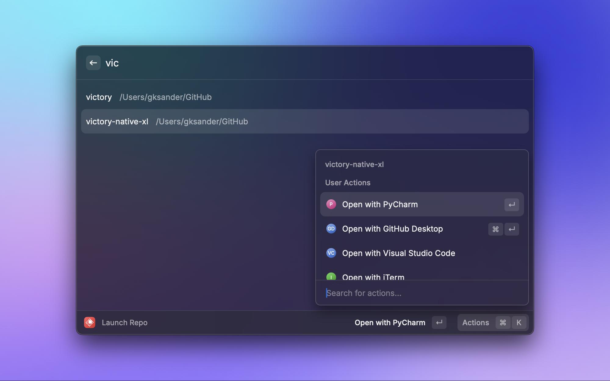

# Repo Launcher

If you're a developer, there's a chance you work with multiple code repositories on a daily basis, opening them in your favorite code editor, your terminal, and on github.com. You might even spin up sample projects just to experiment.

This Raycast extension allows you to quickly search and launch your code repositories/projects in your favorite applications and on GitHub.com.

